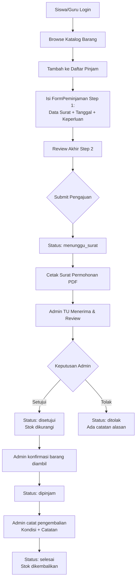

# 📋 Analisis Project: SIPINJAM
**Sistem Peminjaman Barang Inventaris — SMAN 1 Sentolo**

---

## 🏗️ Arsitektur & Tech Stack

| Aspek | Detail |
|---|---|
| **Framework** | React 19 + TypeScript + Vite 6 |
| **Styling** | TailwindCSS v4 (via `@tailwindcss/vite` plugin) |
| **Icons** | Lucide React |
| **Database** | **LocalStorage** (client-side only, tidak ada backend nyata) |
| **Animasi** | Motion (Framer Motion v12) |
| **AI** | `@google/genai` (terdaftar di dependencies, belum dipakai secara eksplisit) |
| **Runtime** | Node.js + Express (untuk deployment) |
| **Port Dev** | 3000 (0.0.0.0) |

> [!NOTE]
> Project ini adalah **prototype berbasis localStorage** — semua data disimpan di browser. Tidak ada koneksi ke database/backend nyata. Cocok untuk demo/capstone, tapi bukan production-ready.

---

## 📁 Struktur Folder

```
Sipinjam_Capstone/
├── src/
│   ├── App.tsx                    ← Root app + state management + routing
│   ├── main.tsx                   ← React entry point
│   ├── index.css                  ← Global CSS
│   ├── types.ts                   ← TypeScript type definitions
│   ├── components/
│   │   ├── LoginView.tsx          ← Halaman login + quick login demo
│   │   ├── Navbar.tsx             ← Navigasi atas + mobile bottom bar
│   │   ├── PeminjamDashboard.tsx  ← Dashboard siswa/guru
│   │   ├── KatalogBarang.tsx      ← Katalog inventaris (browse & pilih)
│   │   ├── DaftarPinjamSheet.tsx  ← "Keranjang" barang yang akan dipinjam
│   │   ├── FormPeminjaman.tsx     ← Form pengajuan peminjaman (2 step)
│   │   ├── PeminjamanSaya.tsx     ← Riwayat peminjaman user
│   │   ├── AdminDashboard.tsx     ← Panel admin TU (approve/reject/return)
│   │   ├── AdminInventaris.tsx    ← CRUD barang inventaris
│   │   ├── AdminPengaturanSurat.tsx ← Pengaturan kop surat & counter
│   │   ├── CetakSuratView.tsx     ← Preview & cetak surat permohonan A4
│   │   └── CetakTemplateKosongView.tsx ← Template surat kosong
│   └── data/
│       ├── db.ts                  ← CRUD fungsi localStorage
│       └── seedData.ts            ← Data awal (users, barang, peminjaman)
```

---

## 👥 Sistem Role & Pengguna

Terdapat **3 role** dengan hak akses berbeda:

| Role | Nama Demo | NIS/NIP | Akses |
|---|---|---|---|
| **Siswa** | Dimas Aditya | `12345678` | Dashboard, Katalog, Daftar Pinjam, Form Peminjaman, Riwayat, Cetak Surat |
| **Guru** | Bu Sri Ratri, S.Pd. | `1980110301` | Sama dengan Siswa |
| **Admin TU** | Pak Bagas Setyawan | `1978052402` | Dashboard Admin, Kelola Inventaris, Pengaturan Surat, Pratinjau Katalog |

---

## 🔄 Alur Kerja Peminjaman (Business Flow)



### Status Peminjaman
| Status | Keterangan |
|---|---|
| `menunggu_surat` | Baru diajukan, menunggu cetak surat fisik |
| `menunggu` | Surat sudah ada, menunggu review admin |
| `disetujui` | Disetujui admin, belum diambil peminjam |
| `dipinjam` | Barang sudah diambil & sedang dipinjam |
| `terlambat` | Melewati tanggal pengembalian rencana |
| `ditolak` | Ditolak oleh admin TU |
| `selesai` | Barang sudah dikembalikan |

---

## 🧩 Komponen Utama — Detail

### 1. `App.tsx` (Root)
- Routing sederhana via `activeTab` state string
- State management: user session, daftar pinjam (keranjang), refresh key
- Menyimpan `daftarPinjam` ke localStorage real-time

### 2. `LoginView.tsx`
- Form login NIS/NIP + Password
- **Quick Login Demo** untuk 3 role langsung
- Simulasi delay 600ms untuk UX login

### 3. `KatalogBarang.tsx` _(26KB — terbesar kedua)_
- Browse & filter barang per kategori
- Menampilkan stok tersedia, lokasi, spesifikasi
- Add to "Daftar Pinjam" (keranjang)

### 4. `FormPeminjaman.tsx` _(26KB — terbesar kedua)_
- **2-step form**: Step 1 = Input data, Step 2 = Review & Submit
- Data surat permohonan otomatis (nama kegiatan, hari, waktu, tempat, ketua panitia)
- Validasi tanggal & stok sebelum submit
- Default status: `menunggu_surat`

### 5. `AdminDashboard.tsx` _(32KB — terbesar)_
- KPI cards: Menunggu, Aktif Dipinjam, Terlambat, Total Barang
- Filter tab: Menunggu / Dipinjam / Selesai
- Side panel untuk approve/reject/catat kembali
- Logika stok: kurang saat approve, tambah saat kembali (kecuali hilang)

### 6. `AdminInventaris.tsx` _(26KB)_
- CRUD penuh untuk barang inventaris
- Mengelola kategori, stok, lokasi, status barang

### 7. `CetakSuratView.tsx`
- Template surat permohonan OSIS format A4
- Menggunakan data dari form + pengaturan surat (kop, nama pejabat)
- Print via `window.print()`

### 8. `AdminPengaturanSurat.tsx`
- Konfigurasi nama/NIP Waka Kesiswaan & Sarpras
- Upload logo sekolah (base64)
- Counter nomor surat otomatis

---

## 📊 Data Model

### `User`
```typescript
{ id, nis_nip, nama, email, role, kelas_jabatan, organisasi?, password? }
```

### `Barang`
```typescript
{ id, kode, nama, kategori_id, foto, stok_total, stok_tersedia, lokasi, status, deskripsi, spesifikasi? }
```

### `Peminjaman`
```typescript
{ id, kode, peminjam_id, peminjam_nama, peminjam_role, peminjam_kelas,
  tgl_pengajuan, tgl_mulai, tgl_kembali_rencana, tgl_kembali_aktual?,
  status, keperluan, kategori_kegiatan, items: DetailPeminjaman[],
  catatan_peminjam?, catatan_admin?, approver_id?,
  // Data surat:
  surat_nama_kegiatan?, surat_hari?, surat_tanggal_kegiatan?,
  surat_waktu_mulai?, surat_waktu_selesai?, surat_tempat?,
  surat_ketua_panitia?, surat_nis_ketua? }
```

### `Kategori`
```typescript
{ id, nama, ikon } // ikon = nama lucide-react icon
```

---

## ✅ Fitur yang Sudah Ada

- [x] Autentikasi multi-role (Siswa, Guru, Admin)
- [x] Katalog barang dengan filter kategori
- [x] Sistem "Daftar Pinjam" (keranjang belanja)
- [x] Form peminjaman 2-step dengan validasi
- [x] Alur approval: menunggu → disetujui → dipinjam → selesai
- [x] Penolakan dengan catatan alasan
- [x] Manajemen stok otomatis (kurang saat approve, tambah saat kembali)
- [x] Catat kondisi barang saat pengembalian (baik/rusak ringan/rusak berat/hilang)
- [x] Cetak surat permohonan format A4 resmi OSIS
- [x] Template surat kosong
- [x] Admin CRUD inventaris barang
- [x] Pengaturan kop surat + upload logo sekolah
- [x] Responsive design (desktop + mobile bottom navigation)
- [x] Riwayat peminjaman per user

---

## ⚠️ Masalah / Bug yang Ditemukan

1. **`LoginView.tsx` Line 133**: `onClick={() => setIsValidPassHelp()}` — fungsi `setIsValidPassHelp` tidak ada di scope `return`, didefinisikan setelah `return` pada baris 240. Ini berfungsi karena JavaScript function hoisting, tapi **style buruk dan membingungkan**.

2. **Kode duplikat di `App.tsx`**: Dua kondisi `activeTab.startsWith("cetak_surat_")` di baris 96–104 dan 175–180 yang render `CetakSuratView` dua kali. Baris 96–104 tidak pernah ter-render karena ada pengecekan user di atas.

3. **Stok tidak terkunci saat "menunggu"**: Saat peminjaman disubmit, stok tidak langsung berkurang. Ini sesuai desain (stok dikurangi saat approved), tapi **tidak ada mekanisme untuk mencegah over-booking** jika banyak user request barang yang sama secara bersamaan.

4. **Password disimpan plain-text di localStorage**: `password: 'password123'` ada dalam data. Tidak aman untuk produksi.

5. **Kode peminjaman tidak unik**: `String(Math.floor(Math.random() * 900) + 100)` bisa menghasilkan duplikat.

6. **Missing import**: `DetailPeminjaman` di `db.ts` baris 76 digunakan tanpa di-import dari `../types`.

---

## 💡 Rekomendasi Pengembangan

### Prioritas Tinggi
1. **Fix bug duplikasi `CetakSuratView`** di `App.tsx`
2. **Fix import `DetailPeminjaman`** di `db.ts`
3. **Gunakan UUID** untuk kode peminjaman yang benar-benar unik

### Prioritas Menengah
4. **Tambah fitur notifikasi** ketika status peminjaman berubah
5. **Tambah search/filter** di AdminDashboard untuk mencari peminjaman
6. **Validasi tanggal** minimum hari ini saat input form peminjaman
7. **Fitur manajemen user** oleh admin (tambah/edit/hapus akun)

### Pengembangan Lanjutan (Capstone++)
8. **Backend nyata** dengan Node.js/Express + database (PostgreSQL/MySQL)
9. **Autentikasi JWT** yang aman
10. **Export laporan** ke Excel/PDF untuk rekapitulasi bulanan
11. **Notifikasi email/WhatsApp** otomatis ke peminjam
12. **QR Code** untuk verifikasi fisik barang
13. **Dashboard analytics** dengan grafik tren peminjaman

---

## 📝 Ringkasan

**SIPINJAM** adalah prototype yang solid untuk sistem peminjaman inventaris sekolah. Alur bisnis lengkap sudah diimplementasikan dengan baik — dari pengajuan, approval, hingga pengembalian barang beserta cetak surat permohonan resmi. Desain sudah responsive dan modern menggunakan Tailwind + blue/slate color scheme yang konsisten dengan identitas institusi sekolah.

Untuk capstone, project ini sudah menunjukkan pemahaman yang baik tentang:
- **State management** React dengan useState + localStorage
- **Role-based access control** (RBAC)
- **Inventory management logic** (stock in/out)
- **Document generation** (cetak surat formal)
- **Responsive UI** (desktop + mobile)
